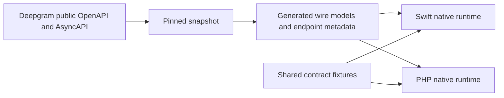

# Deepgram SDK Lab

An independent, unofficial project exploring a specification-driven platform for language-native Deepgram SDKs. The goal is a practical Swift SDK, followed by PHP, backed by pinned API specifications, shared contracts, and explicit feature parity. Deepgram does not maintain or endorse this repository.

**Current state:** Phase 0 research and Phase 1 repository foundation. No SDK functions are implemented yet. See the [progress log](docs/progress/phase-0.md) and [research](docs/research.md).

## Try the foundation

Install PyYAML (`python3 -m pip install PyYAML`), then run:

```sh
./tools/validate-spec
./tools/parity --check
```

The pinned [OpenAPI and AsyncAPI snapshot](specs/README.md) is checked locally. `./tools/update-spec <full-commit-sha>` is the explicit update path.

## Feature parity

Statuses describe this project, not official Deepgram SDKs. [Definitions](parity/README.md).

<!-- parity:start -->
| Capability | Swift | PHP |
| --- | --- | --- |
| Prerecorded transcription | planned | planned |
| Listen v1 realtime | planned | planned |
| Listen v2 / Flux | planned | planned |
| Text-to-Speech REST v1 | planned | planned |
| Text-to-Speech streaming v1 | planned | planned |
| Flux Text-to-Speech v2 | planned | planned |
| Voice Agent | planned | planned |
<!-- parity:end -->

## Architecture



Generated models will be owned by a reproducible generator. Authentication, HTTP and WebSocket lifecycle, retry, streaming, and developer-facing APIs belong to handwritten language-native code. See [architecture](ARCHITECTURE.md).

Swift and PHP install and transcription examples will be added when those packages actually exist. This README will not show nonworking usage as runnable code.

Original project code and prose are Apache 2.0 licensed. Vendored Deepgram specs are [CC BY 4.0](specs/README.md), with source attribution retained.
