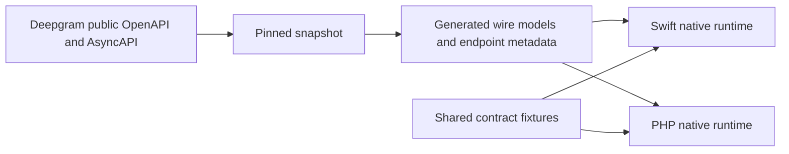

# Deepgram SDK Lab

An independent, unofficial project exploring a specification-driven platform for language-native Deepgram SDKs. The goal is a practical Swift SDK, followed by PHP, backed by pinned API specifications, shared contracts, and explicit feature parity. Deepgram does not maintain or endorse this repository.

**Current state:** Both SDKs have experimental REST and Listen v1/v2 clients. Swift also has experimental Speak v1 streaming and a Voice Agent handshake client, plus a microphone CLI. Swift and PHP offline tests pass in CI; credential-backed behavior is unverified, so no feature is claimed as supported yet. See [progress](docs/progress/phase-3.md) and [research](docs/research.md).

## Try it

Swift, from `sdks/swift`:

```sh
swift build
DEEPGRAM_API_KEY=... swift run deepgram-cli transcribe ./audio.wav
DEEPGRAM_API_KEY=... swift run deepgram-cli flux
DEEPGRAM_API_KEY=... swift run deepgram-voice-playground # macOS SwiftUI demo
```

PHP, from `sdks/php`:

```sh
composer install
DEEPGRAM_API_KEY=... php examples/transcribe.php ./audio.wav
php tests/run.php
```

For the platform tooling, install PyYAML (`python3 -m pip install PyYAML`), then run:

```sh
./tools/validate-spec
./tools/parity --check
./tools/check-generated
```

The pinned [OpenAPI and AsyncAPI snapshot](specs/README.md) is checked locally. `./tools/update-spec <full-commit-sha>` is the explicit update path.

The [voice playground](sdks/swift/Examples/VoicePlayground/VoicePlayground.swift) shows connection state, microphone level, transcript, turn events, request ID, errors, and an approximate arrival-lag metric. macOS must grant microphone access to the launching app. The lag estimate compares wall time since connection with the server audio window and is not an end-to-end latency measurement.

The repository root also contains SwiftPM and Composer manifests, so consumers can depend on its Git URL during development. No version tag or registry package has been published yet. See the [release dry run](docs/releasing.md) and [staff review](docs/staff-review.md) for the remaining verification work.

## Feature parity

Statuses describe this project, not official Deepgram SDKs. [Definitions](parity/README.md).

<!-- parity:start -->
| Capability | Swift | PHP |
| --- | --- | --- |
| Prerecorded transcription | experimental | experimental |
| Listen v1 realtime | experimental | experimental |
| Listen v2 / Flux | experimental | experimental |
| Text-to-Speech REST v1 | experimental | experimental |
| Text-to-Speech streaming v1 | experimental | planned |
| Flux Text-to-Speech v2 | planned | planned |
| Voice Agent | experimental | planned |
<!-- parity:end -->

## Architecture



Generated models are owned by `./tools/generate swift|php|all`. Authentication, HTTP and WebSocket lifecycle, retry, streaming, and developer-facing APIs belong to handwritten language-native code. See [architecture](ARCHITECTURE.md).

Minimal Swift API:

```swift
let deepgram = Deepgram(apiKey: apiKey)
let result = try await deepgram.listen.transcribe(file: audioURL, contentType: "audio/wav")
print(result.results.channels.first?.alternatives?.first?.transcript ?? "")
```

Minimal PHP API:

```php
$deepgram = new DeepgramSdkLab\Client(getenv('DEEPGRAM_API_KEY'));
$result = $deepgram->listen->transcribeFile('audio.wav', 'audio/wav');
echo $result->results->channels[0]->alternatives[0]->transcript;
```

## Looking for work

I’m [Christopher Robison](https://github.com/chrisrobison), and I’m exploring staff-level developer experience and SDK platform roles. If this work is useful, reach me through GitHub. This is a personal project and is not affiliated with Deepgram.

Original project code and prose are Apache 2.0 licensed. Vendored Deepgram specs are [CC BY 4.0](specs/README.md), with source attribution retained.
